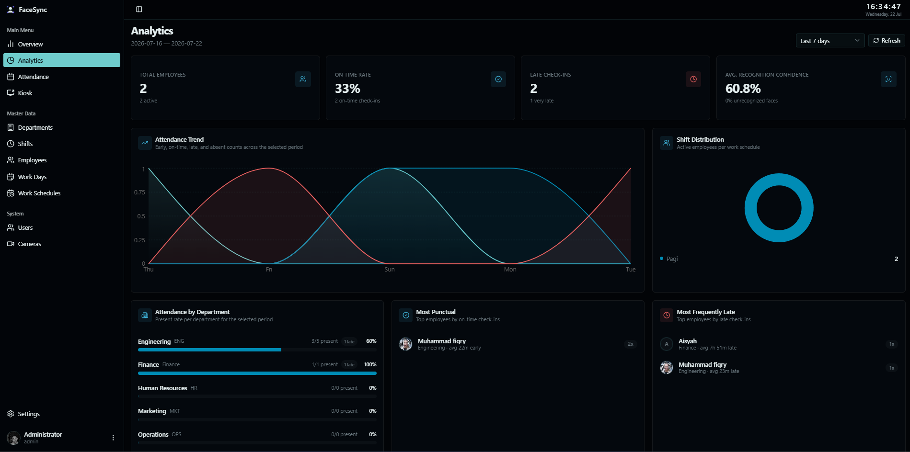

# Face-Sync

Face-Sync is a face-recognition-based attendance application that leverages your existing CCTV infrastructure to automatically detect and record employee attendance — eliminating the need for additional fingerprint scanners, RFID cards, or dedicated attendance hardware.

This repository serves as the **Central Storage & Versioning System** for the automatic update mechanism (*auto-update*) of the **Face-Sync** application suite.

The main Go Updater application running on the production server periodically reads the `version.json` file from this repository to detect, download, and hot-swap modified system components.



### Minimum Specification Requirements

* **CPU:** Minimum 2 Cores / vCPU (**AMD64 / x86_64** Architecture)
* **RAM:** Minimum 4 GB
* **Storage:** Minimum 20 GB SSD
* **OS:** Ubuntu Server 20.04 / 22.04 LTS (or any Linux OS with Docker installed) / Windows 10/11

---

## A. Windows Installation

For Windows environments, FaceSync provides a standalone launcher that manages the system components visually.

### 1. Download and Extract

Download the latest FaceSync Launcher release for Windows (AMD64) and extract the `.zip` file to your preferred directory:

```
https://github.com/fiqryx/face-sync/releases?q=launcher&expanded=true
```

### 2. Install Redis Stack

FaceSync requires Redis Stack to operate. If you don't have it installed, run the following Docker command. (Skip this step if you already have Redis Stack running.)

```bash
docker run -d --name redis-stack-server -p 6379:6379 redis/redis-stack-server:latest
```

> **Note:** Ensure that Docker Desktop is installed and running on your Windows system before executing this command.

### 3. Configure PostgreSQL Database

Ensure you have PostgreSQL installed on your system. Create a new database for FaceSync or adjust your database configuration in the `.env` file:

```env
DB_NAME="facesync"
```

### 4. Run FaceSync Launcher

Navigate to the extracted folder and open `facesync.exe`. On the Launcher interface, click the **Start All** button. Ensure all services are marked as **Running**.

---

## B. Linux Installation (Docker)

Unlike the manual standalone setup, the Linux deployment is designed to be fully automated using Docker Compose. All environment configurations, databases (PostgreSQL, Redis), and core services are bundled together for a seamless setup.

### 1. Clone the Repository

Open your terminal and clone the source code from the official repository:

```bash
git clone https://github.com/fiqryx/face-sync.git
cd face-sync
```

### 2. Build and Run the Containers

Let Docker handle the heavy lifting. Run the following command to download dependencies, build the necessary images, and start all services in the background (detached mode):

```bash
docker-compose up --build -d
```

> **Note:** The initial build process may take a few minutes depending on your internet connection and system performance.

### 3. Verify the Installation

To ensure that all services are up and running without errors, check the container status:

```bash
docker-compose ps
```

If the status shows `Up` or `Running`, the installation is successful!

### 4. Access the Application

Open your web browser and navigate to:

```
http://localhost:3000
```

*(If you are deploying this on a remote server, replace `localhost:3000` with your server's public IP address.)*